# 🛒 Olist E-Commerce Data Warehouse

**End-to-end analytics engineering project** — from raw CSV files to an executive-ready Power BI dashboard, built entirely on **Microsoft Fabric** using a **Medallion Architecture** (Bronze → Silver → Gold) and a **Fact Constellation (Galaxy) Schema**.


---

## 📌 Project Overview

Olist is an online marketplace that connects small businesses across Brazil to major sales channels. This project transforms Olist's raw public e-commerce dataset into a governed data warehouse and a 9-page interactive Power BI dashboard designed to answer 16 core business questions spanning **revenue, logistics, customer satisfaction, sellers, products, and payments**.

The dashboard isn't a set of charts — it's an **answering machine**: every visual exists to directly answer a specific analytical question defined up front (see [Analytical Questions](#-analytical-questions)).

| | |
|---|---|
| **Market** | Olist — online marketplace, Brazil |
| **Period** | September 2016 – October 2018 |
| **Volume** | ~99K orders · ~112K items · ~99K reviews |
| **Source** | 8 CSV files (Kaggle — Olist Public Brazilian E-commerce Dataset) |
| **Built with** | Microsoft Fabric (Data Factory, Lakehouse, Data Warehouse) · Power BI · DAX · Power Query |

---

## 🏗️ Architecture

### Medallion Architecture (Bronze → Silver → Gold)

Raw data flows through three progressively refined layers inside a Microsoft Fabric **Lakehouse** (`olist_lakehouse`), orchestrated by a Fabric **Data Pipeline**:

```
[DF_Bronze_Ecommerce] ──▶ [DF_Silver_Ecommerce] ──▶ [DF_Gold_Ecommerce]
      (raw ingest)          (cleansing)              (dimensional model)
```

**🥉 Bronze — Raw Layer**
- Lakehouse `olist_lakehouse` set up as the landing zone (`Files/raw_files`)
- 8 source CSVs ingested via Dataflow Gen2 (`DF_Bronze_Ecommerce`)
- Headers promoted, initial data types enforced, loaded as raw Delta tables (`Bronze_*`)

**🥈 Silver — Cleansing & Standardization**
- Built with Dataflow Gen2 (`DF_Silver_Ecommerce`) referencing Bronze tables
- Text trimming & standardization (city, state, order status fields)
- Deduplication (e.g., duplicate `review_id` entries in `olist_order_reviews_dataset`, duplicate customer records)
- Category name translation: merged `olist_products_dataset` with `product_category_name_translation` to produce `product_category_name_english`

**🥇 Gold — Dimensional Modeling & Warehouse Loading**
- Built with Dataflow Gen2 (`DF_Gold_Ecommerce`)
- Surrogate keys generated for all dimensions
- 6 dimension tables + 3 fact tables constructed and loaded into the **Fabric Data Warehouse**
- Ready for downstream Semantic Modeling

### Orchestration

A single Fabric **Data Pipeline** sequences execution across all three layers, ensuring Bronze completes before Silver, and Silver before Gold.

---

## 🗂️ Data Model — Fact Constellation Schema (Galaxy Schema)

The warehouse uses a **Fact Constellation Schema**: three fact tables share a common set of conformed dimensions.

| Fact Table | Grain | Key Metrics |
|---|---|---|
| `Fact_OrderItems` | One row per order line item | Price, Freight Value |
| `Fact_Payments` | One row per payment installment | Payment Value, Installments |
| `Fact_Reviews` | One row per review | Review Score |

**Dimensions:** `Dim_Products` · `Dim_Seller` · `Dim_Customers` · `Dim_Orders` · `Dim_Date` · `Dim_PaymentType`

### Bus Matrix

| Dimension | Fact_OrderItems | Fact_Payments | Fact_Reviews |
|---|:---:|:---:|:---:|
| Dim_Products | ✅ | ❌ | ❌ |
| Dim_Seller | ✅ | ❌ | ❌ |
| Dim_Date | ✅ | ❌ | ✅ |
| Dim_Order | ✅ | ✅ | ✅ |
| Dim_Customer | ✅ | ✅ | ✅ |
| Dim_PaymentType | ❌ | ✅ | ❌ |

### Data Model Diagrams

| Logical Model | Physical Model |
|---|---|
| 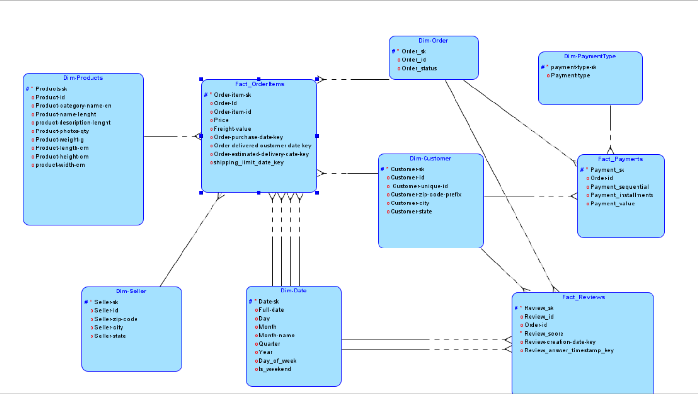 | 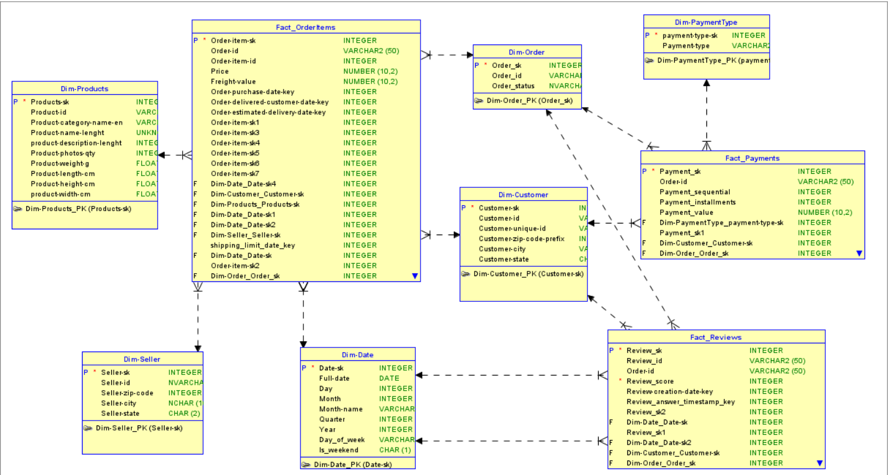 |

> 📎 Full Conceptual, Logical, and Physical model documentation is available in [`docs/Olist_Documentation.pdf`](docs/Olist_Documentation.pdf).

---

## 📐 Core DAX Measures

| Measure | Logic |
|---|---|
| Total Revenue | `SUM(Fact_OrderPayments[payment_value])` |
| Total Orders | `DISTINCTCOUNT(Dim_Orders[order_id])` |
| AOV (Avg Order Value) | `DIVIDE([Total Revenue], [Total Orders], 0)` |
| On-Time Delivery % | `1 - [% Late Orders]` |
| Avg Delay Days (Late Only) | `CALCULATE(AVERAGE(Dim_Orders[Delay_Days]), Dim_Orders[Delay_Days] > 0)` |
| Repeat Purchase Rate | `DIVIDE([Repeat Customers], [Total Customers], 0)` |
| % Negative Reviews | Share of reviews with `review_score <= 2` |
| Avg Revenue per Seller | `DIVIDE([Total Revenue], [Total Sellers], 0)` |

> Full measure list is documented in [`docs/Olist_Documentation.pdf`](docs/Olist_Documentation.pdf).

---

## 📊 Power BI Dashboard

A 9-page interactive report built on a **Direct Lake Semantic Model** (`Olist_Ecommerce_SemanticModel`). The report also includes dynamic filtering, drill-through navigation, and AI-generated executive insights per page — see the full documentation for details.

### Home
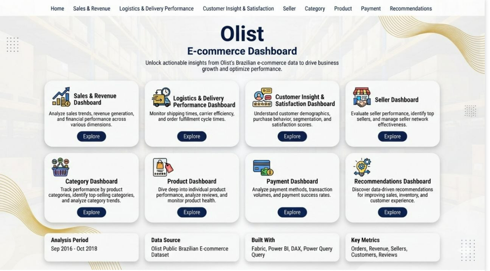

### Sales & Revenue
Revenue trends, YoY growth, and geographic breakdown.
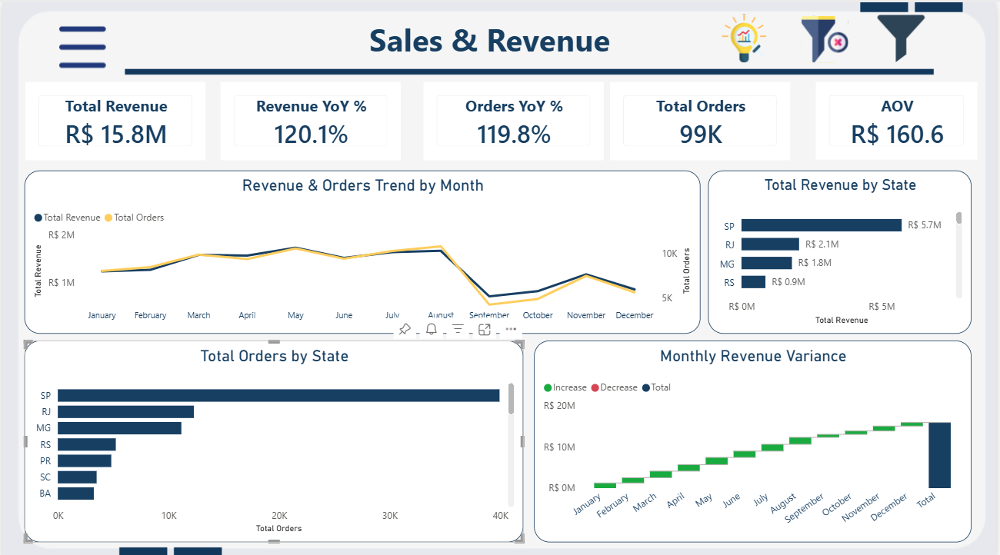

### Logistics & Delivery Performance
On-time delivery %, delay analysis by state.
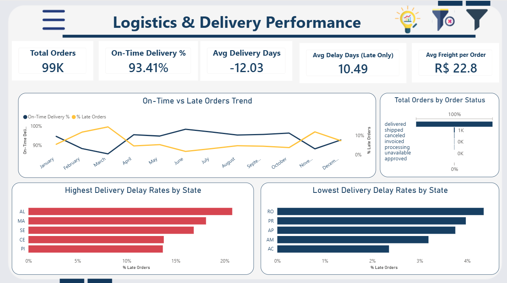

### Customer Insights & Satisfaction
Review score distribution, positive/negative review split.
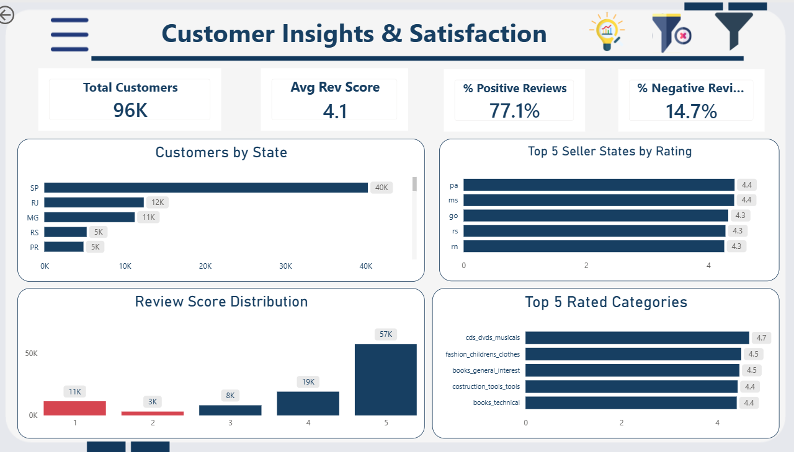

### Seller
Seller performance, revenue per seller, delivery-vs-rating correlation.
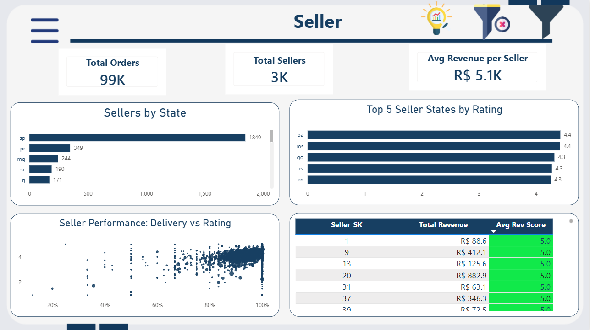

### Category
Top categories by revenue, rating, and freight cost.
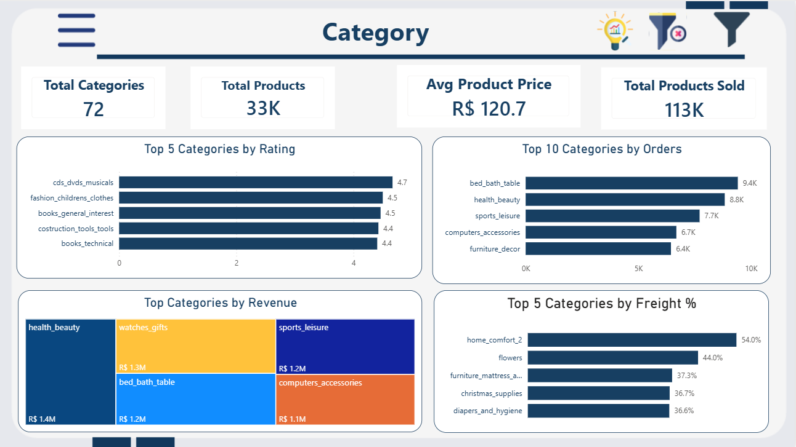

### Product
Product-photo-count vs. sales volume correlation.
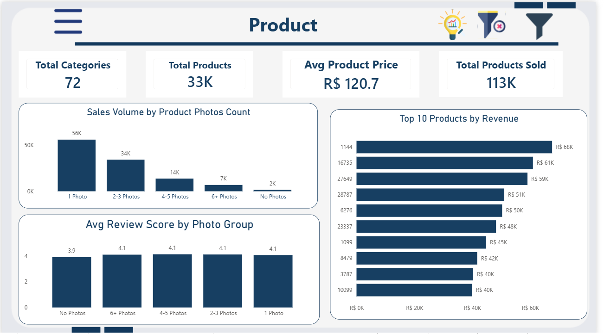

### Payment
Payment method mix, installment behavior by state.
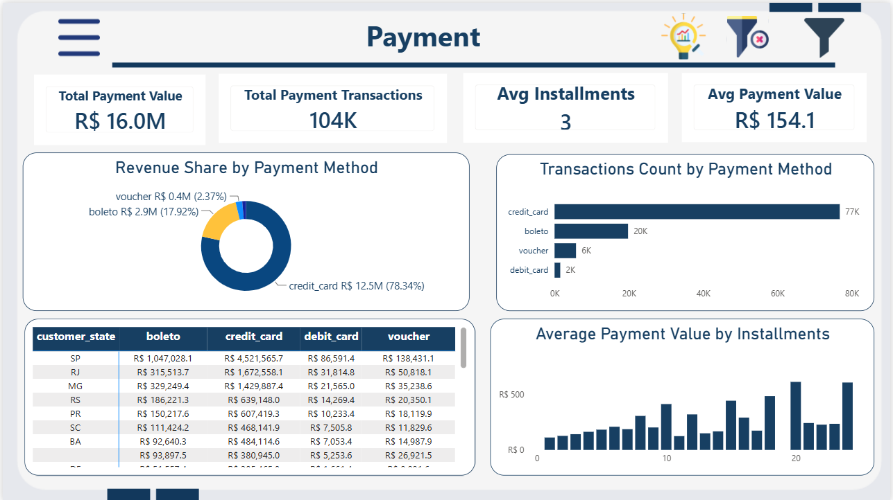

### Recommendations
Data-driven action items per business area.
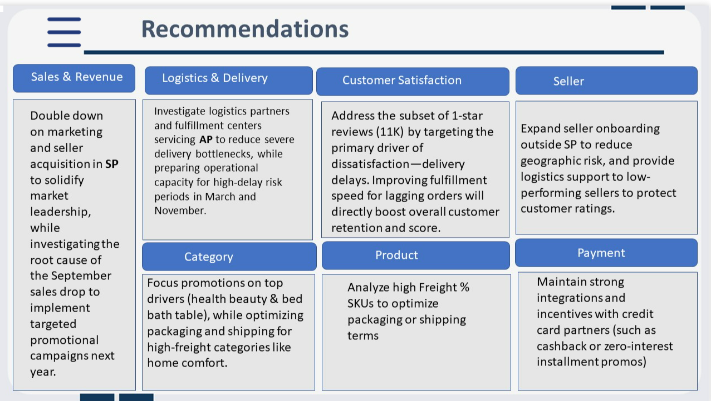

### Key headline results
- **R$ 15.8M** total revenue across **99K orders** (AOV: R$ 160.6)
- **93.41%** on-time delivery rate
- **77.1%** positive reviews vs. **14.7%** negative
- São Paulo (SP) leads revenue generation at **R$ 5.7M**

---

## ❓ Analytical Questions

The dashboard was designed to answer 16 core business questions, including:

- What is our revenue growth performance, and which states drive the most revenue?
- How does delivery performance vary across states, and where are the worst delays?
- What is the overall review score, and which product categories rate highest/lowest?
- Which sellers deserve retention incentives, and does seller volume correlate with delivery speed and ratings?
- Which product categories and SKUs drive revenue vs. high freight cost?
- How do payment method and installment preferences vary geographically?

> Full list of 16 questions available in [`docs/Olist_Documentation.pdf`](docs/Olist_Documentation.pdf).

---

## 🧰 Tech Stack

| Layer | Tools |
|---|---|
| Ingestion & ETL | Microsoft Fabric Data Factory — Dataflow Gen2, Data Pipelines |
| Storage | Fabric Lakehouse (Delta tables) → Fabric Data Warehouse |
| Modeling | Fact Constellation Schema, Direct Lake Semantic Model |
| Transformation | Power Query (M) |
| Analysis | DAX |
| Visualization | Power BI |

---

## 📁 Repository Structure

```
olist-ecommerce-fabric-dwh-powerbi/
│
├── docs/
│   ├── Olist_Documentation.pdf          # Full technical documentation
│   ├── Logical_data_model_diagrams.png
│   └── Physical_model_diagrams.png
│
├── powerbi/
│   ├── Home.png
│   ├── Sales-Revenue.png
│   ├── Logistics-Delivery-Performance.png
│   ├── Customer-Insights-Satisfaction.png
│   ├── Seller.png
│   ├── Category.png
│   ├── Product.png
│   ├── Payment.png
│   └── Recommendations.png
│
└── README.md
```

---

## 🚀 How to Explore

1. Browse the dashboard pages above for a full visual walkthrough of the report
2. Review the data model diagrams under [Data Model](#️-data-model--fact-constellation-schema-galaxy-schema) to understand the Fact Constellation Schema
3. Open [`docs/Olist_Documentation.pdf`](docs/Olist_Documentation.pdf) for the complete architecture, ETL steps, and full DAX measure library

> ℹ️ This project's Semantic Model runs in **Direct Lake mode** directly on the Microsoft Fabric Data Warehouse, so there is no standalone `.pbix` file to download — the report is cloud-native and lives inside the Fabric workspace.

---

## 💡 Key Recommendations (from the Recommendations dashboard)

- **Sales & Revenue:** Double down on marketing/seller acquisition in SP; investigate the September revenue dip for targeted Q4 campaigns
- **Logistics:** Address delivery bottlenecks in high-delay states (e.g., AL, MA) — especially around March/November peak periods
- **Customer Satisfaction:** Target the drivers behind 1-star reviews (largely delivery delays) to lift retention
- **Seller:** Expand onboarding outside SP to reduce geographic concentration risk
- **Category/Product:** Focus promotions on top revenue categories; optimize packaging for high-freight-percentage SKUs
- **Payment:** Maintain strong credit card partnerships and installment incentives

---

## 👩‍💻 Author

**Safaa Mahmoud**
